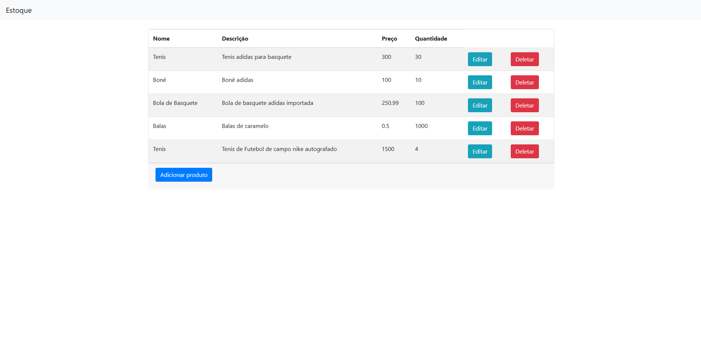
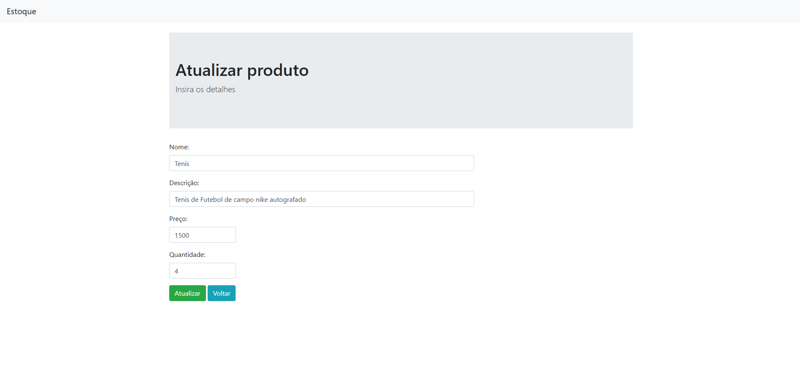

# Estoque Web - Golang

## Descrição
O projeto Estoque web foi desenvolvido em Golang sem finalidades lucrativas apenas com a finalidade de aprendizado, ele contém as funcionalidades basicas para um sistema adicionar, ler, atualizar e remover produtos.
 
Neste projeto foram utilizados:
 - Linguagem Go
 - Banco de dados Sqlite local
 - Pacote gorm para realizar a integração com o banco de dados Sqlite
 - Padrão de projeto MVC

## 🤝 Autores & Colaboradores

<table>
  <tr>
    <td align="center">
      <a href="https://www.linkedin.com/in/levi-cesar-lima/" title="LinkedIn">
         
        
          <b>Levi César</b>
        
      </a>
    </td>
  </tr>
</table>